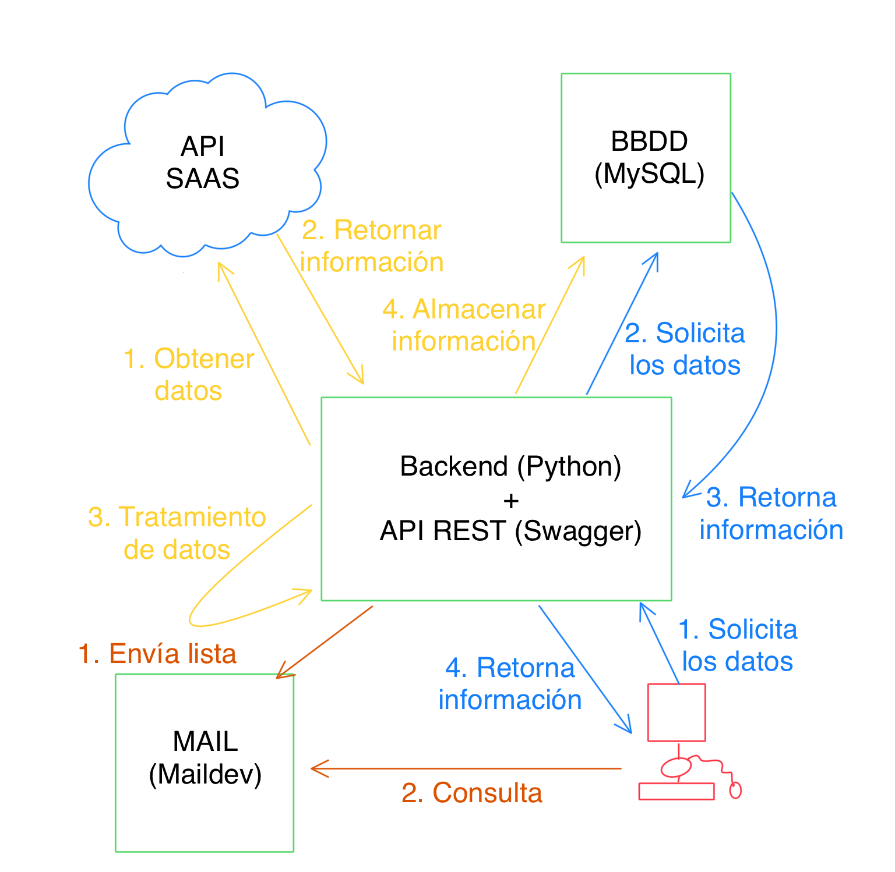

# MII_CC
CC - UGR (Cloud Computing: Fundamentos e Infraestructuras)

# ALERT-ME
<!-- TOC -->
* [Motivación](#motivacin)
* [Descripción](#descripcin)
* [Concretando y planificando el proyecto](#concretando-y-planificando-el-proyecto)
* [Tests](#tests)
* [Docker](#docker)
* [Integración continua](#integracin-continua)
<!-- TOC -->

# Motivación
En la actualidad nos encontramos que la tendencia es la migración de los 
sistemas IAAS a los PAAS y esos sistemas PAAS a aplicaciones SAAS.

Esto está provocando que las grandes empresas basen sus sistemas en un
conjunto de aplicaciones que son suministradas por diversas empresas externas.

Pero tener todos nuestros sistemas como aplicaciones SAAS nos presenta varios problemas. 
Uno de ellos, es que nuestra empresa depende de que los proveedores cumplan con 
su compromiso de calidad de servicio. Un fallo en un proveedor puede provocar
que un departamento de la empresa no pueda realizar sus labores durante esa 
incidencia, que puede llegar a durar desde segundos a meses.

Gran parte de los contratos contiene una cláusula en la cual se especifica
que si no se cumple un mínimo del servicio se procede a realizar un descuento
en la facturación del servicio. Esto provoca que sea de interés a las empresas
tener un análisis del servicio de todos los proveedores.

# Descripción
Lo que se pretende con este proyecto es recoger todas las alertas de diferentes 
SAAS en una misma plataforma. Al estar todas las alertas en una misma plataforma 
se le agiliza el análisis de la información a los responsables.

Se necesita un backend que se encargue de analizar y tratar todas las incidencias que 
se reciba de los diferentes SAAS, no todos los proveedores siguen un patron para 
enviar la información con el mismo formato. Y una vez analizada cada incidencia
y modificada a nuestro estilo ser almacenada en una base de datos.

Se implementa un servicio que realizando consultas REST nos retorne un JSON
con la información solicitada.

# Concretando y planificando el proyecto
Enlace a toda la documentación sobre US y código base [Información de US y código base](docs/hito_1/readme.md)

# Tests
Enlace a toda la documentación sobre los test [Información de los test](docs/hito_2/readme.md)

# Docker
Enlace a toda la documentación sobre docker [Información de docker](docs/hito_3/readme.md)

# Integración continua
Enlace a toda la documentación sobre integración continua [Información de integración continua](docs/hito_4/readme.md)

# Microservicio
Enlace a toda la documentación sobre microservicio [Información de microservicio](docs/hito_5/readme.md)

# Docker Compose
Enlace a toda la documentación sobre Docker Compose [Información de microservicio](docs/hito_6/readme.md)
