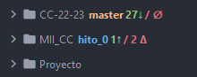
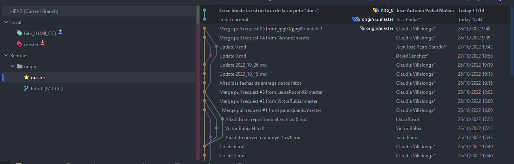

# Hito 0: Descripción del problema a resolver usando correctamente git y GitHub
Índice:
<!-- TOC -->
* [Creación de la cuenta de GitHub](#creación-de-la-cuenta-de-github)
* [Seguridad de la cuenta de GitHub](#seguridad-de-la-cuenta-de-github)
* [Creación del repositorio](#creación-del-repositorio)
* [Git en local](#git-en-local)
<!-- TOC -->

## Creación de la cuenta de GitHub
No ha sido necesario la creación de una nueva cuenta de GitHub porque se va a utilizar mi cuenta actual.
La cual ya esta previamente configurada como cuenta estudiante de la UGR.

## Seguridad de la cuenta de GitHub
Están configurados los sigueintes métodos de seguridad:
* Two-factor methods:
  * Primary two-factor method: Configured: Authenticator app
  * GitHub Mobile: 2 device
* Recovery options:
  * Recovery codes: En caja fuerte en la nube
  * Fallback SMS number: Configured

## Creación del repositorio
Para la creación del repositorio se ha utilizado la interfaz web de GitHub

## Git en local
En mi ordenador personal ya tenía previamente instalado Git para Windows. No he tenido que realizar ninguna instalación ni modificación en local para poder
desarrollar este proyecto. Voy a utilizar el IDE, de JetBarains, PyCharm Professional
para el proyecto. Este IDE proporcina un plugin para GitHub. Todas las interacciones con Git
se van a realizar desde el IDE.

