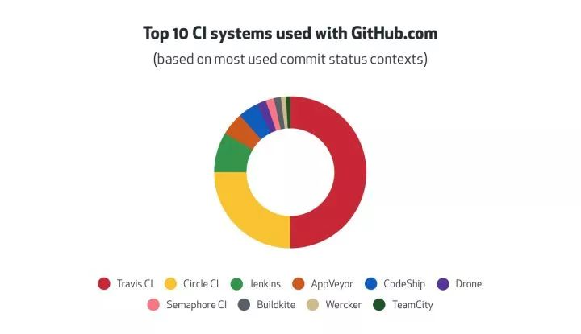
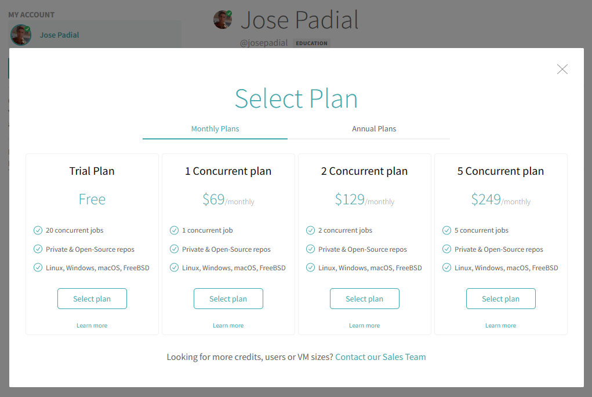

# Hito 4: Integración continua
Índice:
<!-- TOC -->
* [Comparativa de software para CI](#comparativa-de-software-para-ci)
<!-- TOC -->

## Comparativa de software para CI

|    System    | Información                                                                                                                                                                                                                                                                                                                                                                                                                                                                                                                                                                                                                                                                                                                                                                                                                                                                               |
|:------------:|-------------------------------------------------------------------------------------------------------------------------------------------------------------------------------------------------------------------------------------------------------------------------------------------------------------------------------------------------------------------------------------------------------------------------------------------------------------------------------------------------------------------------------------------------------------------------------------------------------------------------------------------------------------------------------------------------------------------------------------------------------------------------------------------------------------------------------------------------------------------------------------------|
|  Travis CI   | Al igual que Jenkins, Travis CI también es uno de los pioneros en el mercado de herramientas de canalización de CI / CD. Inicialmente se implementó solo para proyectos de código abierto y luego se migró para admitir proyectos de código cerrado también. Escrito en el lenguaje de programación Ruby, Travis CI es una de las mejores herramientas de CI / CD para proyectos de código abierto y de nivel empresarial, si sus proyectos están en GitHub o Bitbucket. Al igual que CircleCI, Travis CI también tiene diferentes ofertas para la comunidad de código abierto y las empresas que pretenden utilizar Travis CI en su nube privada (o plataforma autohospedada).                                                                                                                                                                                                           |
|  Circle CI   | CircleCI es una de las mejores herramientas de CI / CD que es adecuada para realizar CI / CD para proyectos de código abierto y proyectos a gran escala. CircleCI Cloud es su oferta basada en la nube, mientras que CircleCI Server es su solución local (o autohospedada). Admite idiomas que se pueden construir en plataformas Windows, Linux y macOS. Es fácil de configurar y utiliza una sintaxis YAML patentada para sus pipelines. En 2019, Forrester Wave nombró a CircleCI como líder en integración continua nativa de la nube .                                                                                                                                                                                                                                                                                                                                              |
|   Jenkins    | Jenkins es una herramienta CI / CD de código abierto, multiplataforma y basada en Java. Ofrece una integración continua, además de facilitar la entrega continua. También permite realizar pruebas e informes en tiempo real. Jenkins se puede instalar simplemente descargando su ejecutable en formato .war e iniciando el mismo desde la terminal.Jenkins Pipeline proporciona un conjunto de herramientas que se pueden utilizar para modelar los canales de entrega "como código". Jenkins implementa la canalización mediante DSL (lenguaje específico del dominio). Es una de las mejores y más utilizadas herramientas de CI / CD, ya que es de código abierto y existe desde hace mucho tiempo.                                                                                                                                                                                  |
|   AppVeyor   | AppVeyor ofrece servicio de CI/CD para mac OS, Linux y Windows para crear, probar e implementar aplicaciones rápidamente en cualquier plataforma. Comience a usar el servicio de CI en minutos y trabaje con cualquier control de código fuente, como GitHub y GitHub Enterprise, Azure Repos, Gitea, Kiln, Bitbucket, GitLab o repositorios personalizados. Cree máquinas virtuales más rápido con acceso sudo/admin y obtenga el beneficio de las implementaciones en varias etapas.                                                                                                                                                                                                                                                                                                                                                                                                    |
|   CodeShip   | CodeShip es una plataforma de integración continua alojada. Si su organización usa GitHub para sistemas de control de versiones, CodeShip podría ser un gran valor agregado, la razón principal es su capacidad para permitir pruebas, compilación e implementación directamente desde proyectos de GitHub. Sigue un modelo de precios freemium en el que 100 compilaciones por mes son gratuitas para proyectos ilimitados. La interfaz de usuario simple de CodeShip y el entorno llave en mano hacen que sea muy fácil obtener compilaciones e implementaciones en unos minutos.                                                                                                                                                                                                                                                                                                       |
|    Drone     | Drone CI es una de las mejores y más modernas herramientas de canalización de CI/CD. No solo proporciona una integración continua, sino que también proporciona una canalización distribuida de CI/CD. Esta característica no está disponible en otras herramientas de CI/CD de código abierto como Jenkins. Utilizando un potente motor de canalización nativo de la nube, Drone le permite automatizar flujos de trabajo de compilación, prueba y lanzamiento.Drone CI es una herramienta de CI/CD nativa de la nube, escalable, flexible y compatible con DevOps. Cada paso de canalización en Drone CI se ejecuta en un contenedor Docker aislado que se descarga durante el tiempo de ejecución. Se puede usar con sistemas operativos populares como Windows, Linux y macOS. También es compatible con la arquitectura ARM (que se utiliza predominantemente en teléfonos móviles). |
| Semaphore CI | Semaphore es una de las mejores herramientas de CI / CD que permite la integración e implementación continuas en la nube. Al igual que Travis CI y CircleCI, esta herramienta CI / CD también viene con una integración perfecta con GitHub. Con las canalizaciones de CI / CD que ofrece Semaphore, los desarrolladores de iOS pueden probar e implementar sus aplicaciones de manera acelerada. Como otras herramientas de CI / CD, Semaphore también proporciona canalizaciones programables para compilaciones secuenciales y compilaciones paralelas.                                                                                                                                                                                                                                                                                                                                |
|  Buildkite   | Buildkite es una herramienta de canalización de CI / CD que permite a los desarrolladores ejecutar canalizaciones rápidas, seguras y escalables con infraestructura local. Es gratuito para proyectos de código abierto, estudiantes y organizaciones docentes. Las organizaciones también tienen la opción de ejecutar agentes Buildkite de código abierto en su infraestructura. Puede instalarlo en plataformas populares como Windows, Linux, macOS y Docker. En Buildkite, los trabajos de compilación se pueden ejecutar en paralelo ejecutando varios agentes y ejecutando el trabajo en paralelo sobre todos los agentes.                                                                                                                                                                                                                                                         |
|   Wercker    | Wercker by Oracle es una plataforma de entrega continua basada en Docker que ayuda a los desarrolladores a acelerar la construcción e implementación de sus aplicaciones y microservicios. La construcción e implementación de canalizaciones se pueden ejecutar utilizando la CLI de Wercker . Wercker activa la canalización cuando se confirma cualquier código nuevo. Wercker se puede integrar con Git y sistemas de notificación populares como HipChat, Slack y Email. Antes de usar Wercker, el usuario debe crear una cuenta de usuario en Wercker (lo que también se puede hacer a través de GitHub) o iniciar sesión con una cuenta de Oracle Cloud. Wercker ofrece dos planes: un plan gratuito y un plan de nube privada virtual.                                                                                                                                            |
|   TeamCity   | TeamCity es una herramienta de canalización de CI / CD basada en servidor en Java. Es desarrollado y mantenido por JetBrains, la compañía detrás del desarrollo de varias herramientas útiles como PyCharm, IntelliJ Idea y más. Está disponible para su instalación en servidores Windows y Linux.TeamCity es de uso gratuito para proyectos de código abierto y ofrece a los equipos pequeños una opción fácil de integrar con Azure DevOps y Jira Software Cloud. También admite el lanzamiento de agentes de compilación en el clúster de Kubernetes.                                                                                                                                                                                                                                                                                                                                 |

Tras haber analizado con detalle el top 10 de plataformas para CI con GitHub se ha decidido
que para este proyecto se van a utilizar Travis CI y Circle CI.

## Integración Continua a través de Travis CI
[Documentación de Travis CI para configurarlo con Python](https://docs.travis-ci.com/user/languages/python/)

Fichero [.travis.yml](../../.travis.yml)

Para configurar Travis CI, me registré desde [Travis CI for Education and the GitHub Student Developer](https://education.travis-ci.com) 
con mi cuenta de GitHub. Como siguiente paso lo que realicé fue darle permisos a mis repositorios
y enlazar el repositorio del proyecto. Como plan se seleccionó el gratuito.

A continuación, usando la documentación mencionada al principio de este apartado configuré el fichero
[.travis.yml](../../.travis.yml)

## Integración Continua a través de Circle CI