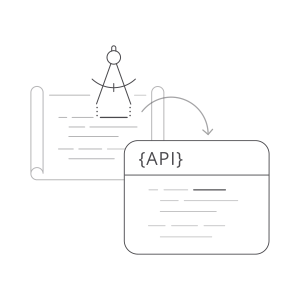
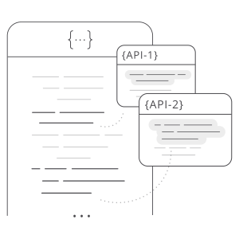
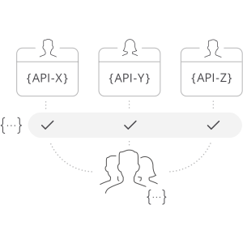
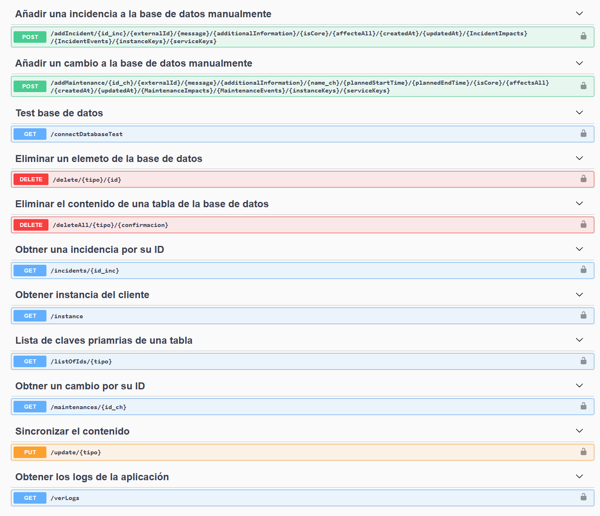

# Hito 5: Diseño y test de un microservicio
Índice:
<!-- TOC -->
* [Elección framework microservicio](#elección-framework-microservicio)
* [El porque de elegir Swagger](#el-porque-de-elegir-swagger)
  * [Modele API con precisión](#modele-api-con-precisión)
  * [Visualiza mientras diseñas](#visualiza-mientras-diseñas)
  * [Estandarice sus estilos de diseño en todos los equipos](#estandarice-sus-estilos-de-diseño-en-todos-los-equipos)
* [Swagger + Python + Flask](#swagger--python--flask)
  * [¿Qué es Flask Python?](#qué-es-flask-python)
  * [¿Qué es Flasgger?](#qué-es-flasgger)
  * [Requisitos técnicos](#requisitos-técnicos)
  * [Proceso de instalación](#proceso-de-instalación)
  * [Funcionalidades de Swagger implementadas](#funcionalidades-de-swagger-implementadas)
  * [Acceso a Swagger](#acceso-a-swagger)
* [Logs](#logs)
  * [Niveles de registros](#niveles-de-registros)
<!-- TOC -->

## Elección framework microservicio
Como framework microservicio se ha elegido [Swagger](https://swagger.io/).
El diseño es la base del desarrollo de su API. Swagger hace que el diseño de API sea muy sencillo, con herramientas 
fáciles de usar para desarrolladores, arquitectos y propietarios de productos.

## El porque de elegir Swagger
### Modele API con precisión
El diseño de API es propenso a errores, y es extremadamente difícil y requiere mucho tiempo detectar y rectificar errores 
al modelar API. Swagger Editor fue el primer editor creado para diseñar API con OpenAPI Specification (OAS), y ha seguido 
satisfaciendo las necesidades de los desarrolladores que crean API con OAS. El Editor valida su diseño en tiempo real, 
verifica el cumplimiento de OAS y proporciona retroalimentación visual sobre la marcha.



### Visualiza mientras diseñas
Las mejores APIs están diseñadas pensando en el consumidor final. Las herramientas de Swagger como Swagger Editor y 
SwaggerHub proporcionan un editor YAML con un panel de visualización para que los desarrolladores trabajen y vean cómo 
se verá y se comportará la API para su consumidor final.



### Estandarice sus estilos de diseño en todos los equipos
La entrega de API que comparten comportamientos comunes, patrones y una interfaz RESTful consistente facilitará enormemente 
el trabajo de las personas que las construyen y los consumidores que desean usarlas. SwaggerHub está equipado con una 
herramienta de estandarización de API incorporada que puede hacer que sus API cumplan con las pautas de diseño de su organización.



## Swagger + Python + Flask
### ¿Qué es Flask Python?
Un marco es una biblioteca de código utilizada por los desarrolladores para crear y mantener aplicaciones web confiables
y escalables. Hay varios marcos disponibles para Python, como Tornado, Pyramind y, por supuesto, Django (que a menudo se 
compara con Flask).

Flask(🌶) es un microframework Python para el desarrollo web. A pesar de estar construido con un núcleo pequeño y 
considerado una interfaz de puerta de enlace de servidor web (WSGI) muy ligera, Flask destaca por su filosofía fácil de 
extender. Fue diseñado para escalar a aplicaciones complejas y para admitir un inicio fácil y rápido.

Además, otra gran ventaja de Flask es su funcionalidad. Aunque ofrece sugerencias, Flask no requiere obligatoriamente 
diseños de proyecto u otras dependencias. En cambio, permite a los desarrolladores elegir las bibliotecas y herramientas 
que desean usar y, además, tiene varias extensiones disponibles, que son proporcionadas por la comunidad.

### ¿Qué es Flasgger?
Implementaremos la documentación API de este método GET usando flasgger, que es una extensión de Flask para generar y 
construir la especificación OpenAPI

Flasgger también proporciona validación de los datos entrantes, utilizando la misma especificación que puede validar si 
los datos recibidos como POST, PUT, PATCH son válidos contra el esquema definido usando diccionarios YAML, Python


### Requisitos técnicos
Tener instalado Python, un entorno virtual de Python.

### Proceso de instalación
Instale el paquete Flask y Flasgger usando pip (instalador del paquete de Python):
```bash
pip install Flask flasgger
```
En nuestro caso lo que haremos será añadir la siguiente dependencia al fichero [requirments.txt](../../src/requirements.txt)
```text
Flask==2.2.2
flasgger==0.9.5
```
Después de eso, solo necesita ejecutar el siguiente comando:
```bash
pip install -r requirements.txt
```

### Funcionalidades de Swagger implementadas


### Acceso a Swagger
```bash
http://localhost:8082/swagger/
```

## Logs
Para los logs se ha utilizado el módulo logging de Python, el cual nos permite hacer una gestión de los logs.
Para ver los logs se puede consultar el fichero logging.conf desde la terminal o desde la interfaz web de Swagger.

Este módulo define funciones y clases que implementan un evento flexible Sistema de registro para aplicaciones y bibliotecas.

La ventaja clave de tener la API de registro proporcionada por un módulo de biblioteca estándar es que todos los módulos 
de Python pueden participar en el registro, por lo que su registro de aplicación puede incluir sus propios mensajes 
integrados con mensajes de terceros Módulos.

### Niveles de registros
Los valores numéricos de los niveles de registro se indican en la tabla siguiente. Estos son: principalmente de interés 
si desea definir sus propios niveles y los necesita para tienen valores específicos relativos a los niveles predefinidos. 
Si define un nivel con el mismo valor numérico, sobrescribe el valor predefinido; el predefinido El nombre se ha perdido.

| Nivel    | Valor numérico |
|----------|----------------|
| CRITICAL | 50             |
| ERROR    | 40             |
| WARNING  | 30             |
| INFO     | 20             |
| DEBUG    | 10             |
| NOTSET   | 0              |
