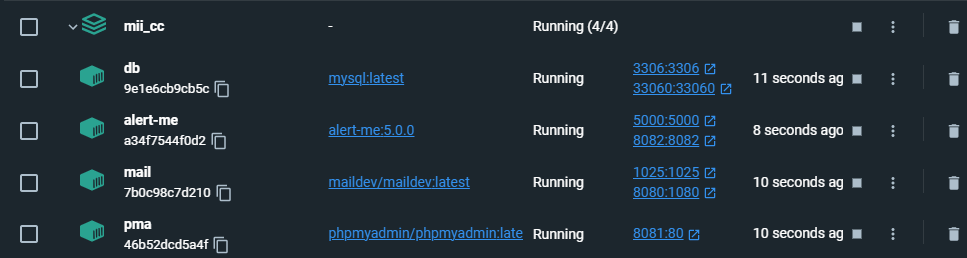

# Hito 6: Composición de servicios
Índice:
<!-- TOC -->
* [Hito 6: Composición de servicios](#hito-6--composición-de-servicios)
<!-- TOC -->

Nos encontramos el código en detalle en el siguiente fichero [docker-compose.yml](../../docker-compose.yaml)

## Composición de Cluster
Se han necesitado las siguientes imágenes:
* mysql:latest
* phpmyadmin/phpmyadmin:latest
* maildev/maildev:latest
* alert-me:5.0.0

Se han creado las siguientes redes:
* vnsq6

Se han creado los siguientes PVs:
* db_data

## Explicación de cada imagen
### MySQL
Toda la información que se trata la aplicación se almacena en una base de datos.
Para ello se ha elegido una MySQL.
A esta imagen se le ha asignado la IP estática 10.5.0.5. Se le ha creado un PVs denominado
db_data. En el código nos encontramos un fichero [ALERT-ME.sql](../../sql/ALERT-ME.sql), 
el cual se utiliza en la construcción de la imagen para la inicialización de la base de datos.
Se ha especificado que siempre se inicie el POD al encender el sistema. Y por ultimo se han
configurado sus variables de entorno.
````yaml
db:
    image: mysql:latest
    container_name: db
    volumes:
      - db_data:/var/lib/mysql
      - ./sql/ALERT-ME.sql:/docker-entrypoint-initdb.d/ALERT-ME.sql
    restart: always
    environment:
      - MYSQL_ROOT_PASSWORD=1234
      - MYSQL_DATABASE=ALERT-ME
      - MYSQL_USER=user
      - MYSQL_PASSWORD=1234
    ports:
      - 3306:3306
      - 33060:33060
    networks:
      vnsq6:
        ipv4_address: 10.5.0.5
````

### phpMyAdmin
Esta imagen se utliliza para poder acceder a la base datos y poder trabajar con ella.
Se ha especificado que siempre se inicie el POD al encender el sistema. Posee un link para que 
dependa de MySQL. Y en sus variables de entorno le indicamos a la base de datos que se debe
de conectar. A esta imagen se le ha asignado la IP estática 10.5.0.6.
````yaml
phpMyAdmin:
    image: phpmyadmin/phpmyadmin:latest
    container_name: pma
    restart: always
    links:
      - db
    environment:
      PMA_HOST: db
      PMA_PORT: 3306
      PMA_ARBITRARY: 1
    ports:
      - 8081:80
    networks:
      vnsq6:
        ipv4_address: 10.5.0.6
````

### MailDev
Cuando se guarda una incidencia o cambio en la base da datos se genera un correo con la información
para poder visualizar todos esos correos hemos usado esta imagen. A esta imagen se le ha asignado la IP estática 10.5.0.7.
Se ha especificado que siempre se inicie el POD al encender el sistema.
````yaml
mailDev:
    image: maildev/maildev:latest
    container_name: mail
    restart: always
    ports:
      - 8080:1080
      - 1025:1025
    networks:
      vnsq6:
        ipv4_address: 10.5.0.7
````

### alert-me
Esta imagen es la aplicación que se ha desarrollado. Para su construccion se utiliza el 
fichero [Dockerfile](../../Dockerfile).  A esta imagen se le ha asignado la IP estática 10.5.0.8.
Se ha especificado que siempre se inicie el POD al encender el sistema.
````yaml
alet-me:
    image: alert-me:5.0.0
    container_name: alert-me
    build: .
    restart: always
    ports:
      - 5000:5000
      - 8082:8082
    networks:
      vnsq6:
        ipv4_address: 10.5.0.8
````

## Manual de uso
Como requisito previo solo nos encontramos que necesitamos tener docker-compose en el host en su versión 2.
La versión 1 no es compatible. Y para iniciar todo el sistema solo necesitamos ejecutar el siguiente comando en 
el directorio padre (donde se encuentra el fichero [docker-compose.yml](../../docker-compose.yaml))
````shell
docker-compose up -d
````


## Pruebas
Se han procedido a probar todas las funcionalidades de la aplicación y cumplen satisfactoriamente.

## Pruebas de velocidad
Al estar todo contenido en un mismo stack con su propia red se han conseguido mejores resultados
